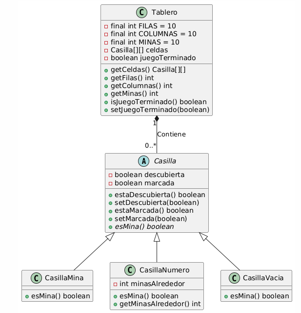

---

## 🧠 Nombre del proyecto: Buscaminas

### 🎯 Descripción

> Proyecto de consola en Java que simula el clásico juego **Buscaminas**, donde el jugador debe descubrir todas las casillas sin pisar ninguna mina.
> Cuenta con persistencia de partidas, manejo de excepciones, pruebas unitarias, y está diseñado siguiendo principios de diseño orientado a objetos.

---

## 🚀 Características

* 🕵️‍♂️ Descubrir casillas
* 🚩 Marcar y desmarcar posibles minas
* 💣 Generación aleatoria de minas
* 🧠 Lógica para calcular números vecinos
* 💾 Guardado y carga de partidas
* 📤 Serialización con Java
* ✅ Pruebas unitarias con JUnit 5
* 📊 Separación en modelo, vista, controlador y servicios

---

## 🧱 Arquitectura del Proyecto

```
buscaminas-app/
│
├── modelo/          → Clases como Tablero y Casilla
├── servicios/       → Lógica de negocio (inicialización, reglas del juego)
├── controlador/     → Control del flujo del juego
├── vista/           → Interacción con el usuario (consola)
├── excepciones/     → Manejo de errores personalizados
├── persistencia/    → Guardado/carga de partidas
└── tests/           → Pruebas unitarias con JUnit
```

---

## 🛠️ Requisitos

* Java 17+
* Maven 3.8+
* JUnit 5 (automáticamente incluido por Maven)

---

## ⚙️ Cómo ejecutar el proyecto

```bash
# Clonar el repositorio
git clone https://github.com/usuario/buscaminas-app.git
cd buscaminas-app

# Compilar el proyecto
mvn clean package

# Ejecutar el juego
java -cp target/buscaminas-app-0.0.1-SNAPSHOT.jar com.ups.buscaminas.buscaminas_app.App
```

---

## ✅ Cómo ejecutar las pruebas

```bash
mvn test
```

---

## 📂 Estructura del repositorio

* `docs/` → Diagramas y capturas de pantalla
* `src/main/java` → Código fuente
* `src/test/java` → Pruebas unitarias
* `README.md` → Documentación del proyecto
* `pom.xml` → Archivo de configuración de Maven

---

## 🖼️ Diagrama UML  



## 📸 Captura del proyecto  

### Código compilado y en ejecución


---

## 👨‍💻 Autor

* Jorge Rivera
* Universidad Politécnica Salesiana
* Proyecto académico de Programación Orientada a Objetos
